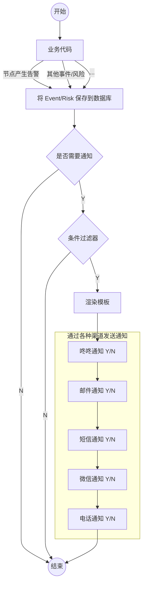

# 事件/风险生命周期

```mermaid
graph TD

Start((开始))
End((结束))

Biz[业务代码]

DB[将 Event/Risk 保存到数据库]

IsNotice{是否需要通知}

Filter{条件过滤器}
Render[渲染模板]

Dong[咚咚通知 Y/N ]
Email[邮件通知 Y/N ]
SMS[短信通知 Y/N ]
Wechat[微信通知 Y/N ]
Phone[电话通知 Y/N ]

Start --> Biz

Biz -- 节点产生告警 --> DB
Biz -- 其他事件/风险 --> DB
Biz -- ... --> DB

DB --> IsNotice

IsNotice -- N --> End
IsNotice -- Y --> Filter
Filter -- N --> End
Filter -- Y --> Render
Render --> Dong

subgraph 通过各种渠道发送通知
Dong --> Email
Email --> SMS
SMS --> Wechat
Wechat --> Phone
end

Phone --> End

```
